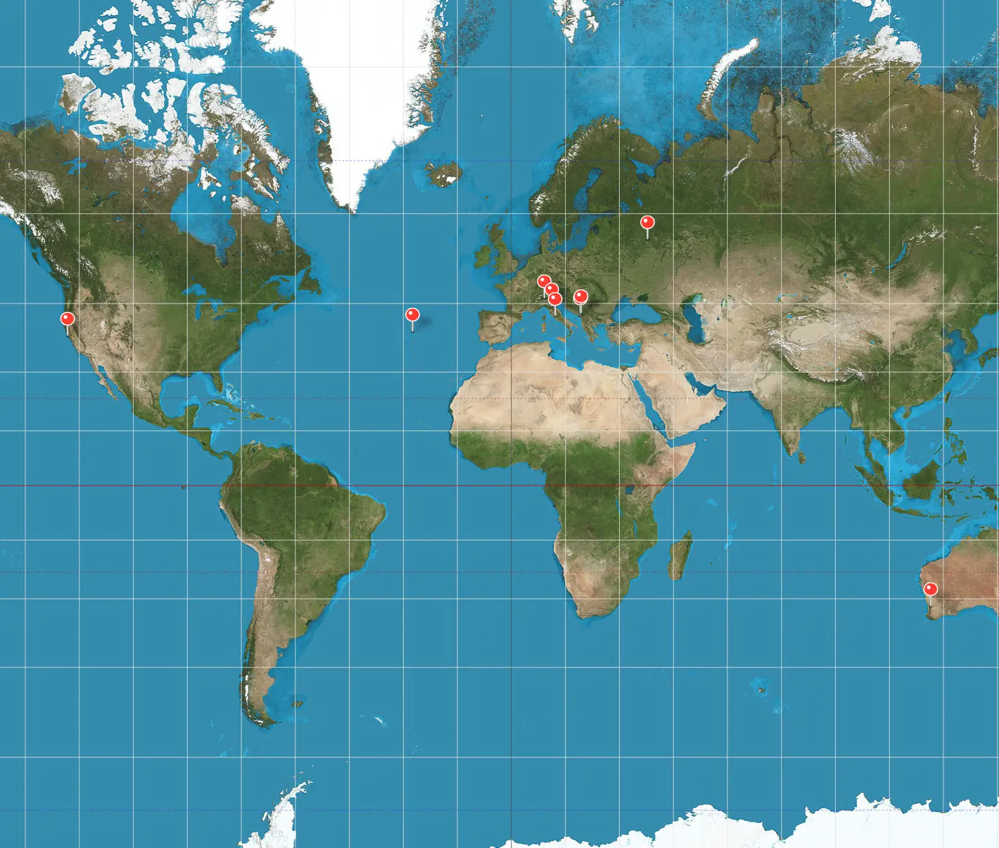
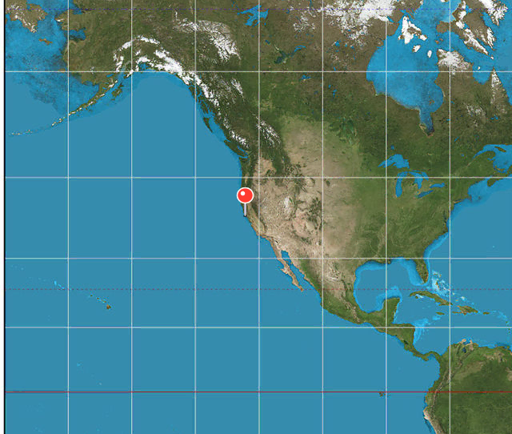

onmap
=====

Go package onmap puts pins on a world map image.

The images (mercator.jpg, pin.png and pin-shadow.png) are embedded in the package,
no need to ship them separately.

Image licensing
---------------

The default world map used is:
https://en.wikipedia.org/wiki/File:Mercator_projection_SW.jpg
License: Strebe, CC BY-SA 3.0 <https://creativecommons.org/licenses/by-sa/3.0>, via Wikimedia Commons

Pin images are created by the author of the package, licensed under this package license (MIT).


Example
-------

```go
package main

import (
    "os"
    "image/png"

    "github.com/dchest/onmap"
)

func main() {
	coords := []onmap.Coord{
		{42.1, 19.1},             // Bar
		{55.755833, 37.617222},   // Moscow
		{41.9097306, 12.2558141}, // Rome
		{-31.952222, 115.858889}, // Perth
		{42.441286, 19.262892},   // Podgorica
		{38.615925, -27.226598},  // Achores
		{45.4628329, 9.1076924},  // Milano
		{43.7800607, 11.170928},  // Florence
		{37.7775, -122.416389},   // San Francisco
	}

	m := onmap.Pins(coords, onmap.StandardCrop)
	f, err := os.Create("out.png")
	if err != nil {
		log.Fatal(err)
	}
	defer f.Close()
	if err := png.Encode(f, m); err != nil {
		log.Fatal(err)
	}
}
```

Result (shown as webp, not png):



Just one coordinate for San Francisco and using StandardCrop:


